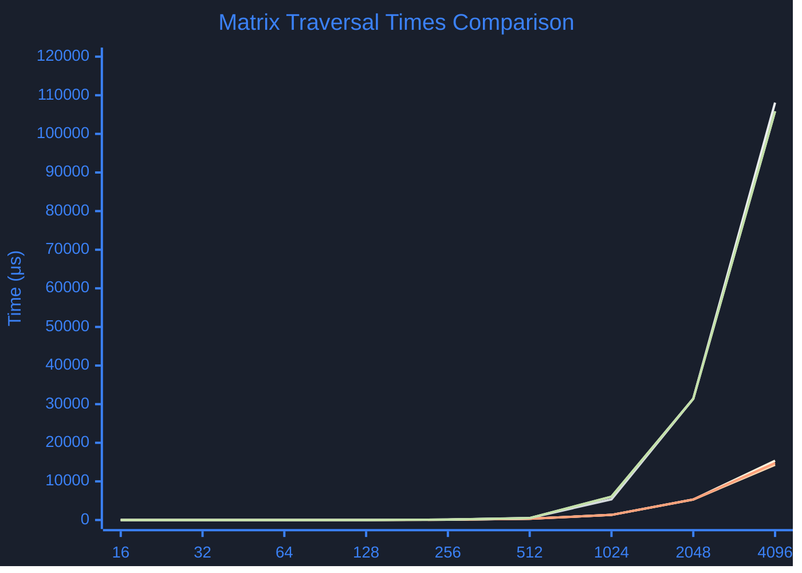

Understanding how memory access patterns affect performance is crucial in systems programming, especially in languages like [[tags/C]] where manual memory management is central. This post explores how different ways of traversing a matrix—either by rows or by columns—impact execution time, especially when matrices grow in size. This exploration provides insights into cache utilization and access efficiency in [[tags/C]].
## The Problem

In computing, **matrix traversal** is a common operation in numerous applications, from graphics rendering to scientific computing. However, not all traversal methods yield the same performance, particularly on modern processors where **cache memory** plays a pivotal role. Cache memory, which sits between the CPU and the main memory, speeds up data access when it can predictably store and retrieve frequently accessed data. If our access pattern is unpredictable or inefficient, it may lead to frequent cache misses, slowing down the program.

In this exercise, we analyze two primary access patterns:

1. **Row-wise traversal**: Iterating over matrix elements by rows, where elements stored consecutively in memory are accessed sequentially.
2. **Column-wise traversal**: Iterating over matrix elements by columns, accessing non-consecutive elements in memory, potentially increasing cache misses.

## Analysis Goals

Through the next test, we aim to understand:

- **How access patterns influence performance**: Observing execution time when traversing by rows vs. columns.
- **The effect of matrix size on cache efficiency**: Determining if larger matrices lead to a noticeable difference in performance between row and column access.
- **Practical optimization insights**: Applying these findings to write more cache-efficient code, especially for performance-critical applications.

## Performance Evaluation

It's very important to know how to evaluate the performance of out codes. Know how much time out code takes. In my personal context ( [[tags/gamedev]] ) it is imperative since this defines the performance of our games.

Measuring the time it takes to execute a piece of code is relatively simple if we define a function `captureTime` that works as a stopwatch:

```c
t1 = captureTime();

// code to measure

t2 = captureTime();

time = t2 - t1; // time it takes to execute the code
```

The problem with this method is that the result and cost of this `captureTime` function is **hardware** and **operating system dependent**.

In addition to this problem, we have to have in mind that the same exact code doesn't always takes the same time to execute due to the complexity of the factors involved nowadays. The code to be measure does **not run directly on the architecture**, but rather there is an operating system and devices that **interrupt** the usual flow of execution. So what we do is run the same code several times and do a **statistical analysis** of the result to get a more accurate values.
## Evaluating matrix

To analyze performance, we evaluate a simple matrix traversal code to compare execution times for **row-wise** and **column-wise** accesses. For small matrices (e.g., `8x8`), the execution times are almost identical for both traversal methods. However, as matrix size increases, the differences become significant.

```c title="initializes the array"
void init_data()
{
    int i, j;
    for(i=0; i<ROWS; i++) {
       for(j=0; j<COLS; j++) {
		  M[i][j] = i+j*10;
       }
    }
}
```

```c title="Traverse matrix 'M' by rows"
void matrix_rows()  
{  
    int i, j;  
    for(i=0; i<ROWS; i++) {  
       for(j=0; j<COLS; j++) {  
          M[i][j] = i+j;  
       }  
    }
}
```

```c title="Traverse matrix 'M' by columns"
void matrix_cols()
{
    int i, j;
    for(j=0; j<COLS; j++) {
       for(i=0; i<ROWS; i++) {
          M[i][j] = i+j;
       }
    }
}
```

In our test setup, the traversal code is executed multiple times, and the lowest time (in **microseconds**) is selected after up to 10 repetitions. To ensure accuracy, the three lowest execution times are validated to have an error margin below **1%** (**0.01**).

```c title="Execute the call f() and measure its execution time in useconds"
double measure( void (*f)(void) )
{
    return measure_full((int(*)(int,int))f, 0xDEAD, 0xDEAD, 3, 0.01, 10); // 1% error
}
```

Matrix sizes are incremented in powers of two (**8**, **16**, **32**, ...) for both rows and columns, and execution times are recorded for each case.

| Matrix Size   | Time init | Time row 1 | Time row 2 | Time row 3 | Time col 1 | Time col 2 | Time col 3 |
| :------------ | :-------- | :--------- | :--------- | :--------- | :--------- | :--------- | :--------- |
| `16 x 16`     | 0μs       | 0μs        | 0μs        | 0μs        | 0μs        | 0μs        | 0μs        |
| `32 x 32`     | 2μs       | 2μs        | 2μs        | 2μs        | 3μs        | 2μs        | 2μs        |
| `64 x 64`     | 6μs       | 6μs        | 6μs        | 6μs        | 3μs        | 3μs        | 3μs        |
| `128 x 128`   | 19μs      | 21μs       | 10μs       | 19μs       | 16μs       | 13μs       | 15μs       |
| `256 x 256`   | 62μs      | 63μs       | 63μs       | 63μs       | 114μs      | 116μs      | 116μs      |
| `512 x 512`   | 343μs     | 332μs      | 332μs      | 332μs      | 508μs      | 503μs      | 503μs      |
| `1024 x 1024` | 1319μs    | 1324μs     | 1323μs     | 1321μs     | 6663μs     | 5364μs     | 6067μs     |
| `2048 x 2048` | 5293μs    | 5312μs     | 5296μs     | 5320μs     | 31473μs    | 31377μs    | 31384μs    |
| `4096 x 4096` | 14514μs   | 15338μs    | 14309μs    | 14742μs    | 108086μs   | 105834μs   | 105835μs   |
|               |           |            |            |            |            |            |            |

## Conclusions

### Is the execution time similar when traversing by rows or columns?

The execution time depends on the matrix size. As we can observe in the table above, for smaller matrix sizes like `16x16` or `32x32`, the access times stabilize for both **rows** and **columns**, showing almost identical performance.
### What happens as the matrix size increases?

When moving to slightly larger sizes, such as `64x64` or `128x128`, access times are shorter for **columns** than for **rows**. This difference becomes even more significant as the matrix size continues to grow.
### What happens with matrices of size `256x256` and larger?

For matrices equal to or larger than `256x256`, access times change. **Row-wise** access starts showing lower access times compared to **column-wise** access, and this difference increases as the matrix size grows. This behavior is particularly noticeable with larger matrices like `4096x4096`.
### What can be concluded from the table? Is there a change in execution times between the two traversal methods?

Execution times vary based on the matrix size and whether we are accessing by **row** or by **column**. The time for accessing rows and columns is very similar for smaller matrices, but as the matrix size increases, the differences become more apparent.
### How much space does one row occupy? Why does this happens?

The size of a row depends on the size of the matrix. For example, in a $4096 \times 4096$ matrix, the size of a row is $4096$ elements. If we calculate the size of one row, we get approximately **4KB** ($\frac{4096}{1000} = 4.096 \, \text{KB}$). This is important because the **cache behavior** influences how data is loaded and accessed.
### How do the cache levels of your CPU impact the results?

```bash
CPU
	11th Gen Intel(R) Core(TM) i7-11700 @ 2.50GHz

	Base speed:				2,50 GHz
	Sockets:				1
	Cores:					8
	Threads:				16
	Cache L1:				80K (per core)
	Cache L2:				512K (per core)
	Cache L3:				16MB (shared)
```

For smaller matrices, where the entire matrix fits into the **L1 cache**, the execution times are very fast and nearly identical for both row-wise and column-wise traversals. However, as the matrix size increases and it no longer fits into the **L1 cache**, it has to be loaded into **L2** or even **L3 cache**, which increases the access time. This explains the increase in access time for column traversal: when accessing data by column first, followed by row, the elements we need to access may not be present in the lower-level caches, resulting in slower memory access.

---
In summary, matrix traversal patterns can significantly impact performance, especially as matrix size increases. For small matrices, both row-wise and column-wise accesses show similar performance due to the data fitting within the CPU's **L1 cache**. However, as the matrix size grows, row-wise traversal becomes increasingly efficient. This behavior is driven by how data is stored in memory and accessed, and how the CPU's cache hierarchy influences performance.

### Key Takeaways:

- **Cache locality** plays a significant role in matrix traversal performance, where **row-wise traversal** benefits from better cache utilization due to sequential memory access.
- **Smaller matrices** show little difference in access times, but as matrix sizes increase and exceed cache sizes, the differences become more pronounced.
- **Optimization insight**: In real-world applications, such as [[tags/gamedev]] or scientific computing, choosing the correct traversal method based on matrix size can lead to significant performance improvements.

If you've made it this far, thank you for reading! I hope this analysis offers valuable insights for optimizing performance in your own projects.